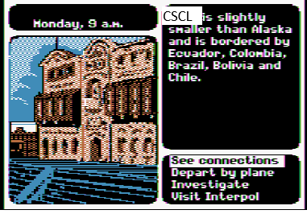

# CSCL-CHANGE-DETECTIVE

We will compare CSCL data to upstream or downstream sources. When one source changes we will send interpol notices to alert the data police that suspect data is on the lam. Friends, this is our data gumshoe, our laws, the trick is never to be afraid. 



## Dependencies

1. Arcpy
2. Connectivity to a CSCL geodatabase
3. Connectivity to the external layer (AGOL, PostGIS, etc)

## Compare a CSCL Feature Layer to an AGOL Hosted Feature Layer

See geodatabase-scripts/sample-agol.bat.

```bat
python.exe src\py\investigate.py <geodatabase> 
                                 <featureclass> 
                                 <featureclass columns> 
                                 <external layer> 
                                 <external layer columns> 
                                 <evidence folder> 
                                 <log folder>
```

### Positional Arguments

| Position | Name | Example | Description |
|----------|------|-------------|---------|
| 1 | `geodatabase` | `C:\temp\cscl_read_only.sde` | SDE file to geodatabase |
| 2 | `featureclass` | `CSCL_PUB.HistoricDistrict` | Full path to feature class |
| 3 | `featureclass columns`  | `LP_NUMBER,SHAPE_AREA` | Comma-delimited list of columns |
| 4 | `external layer` | `https://services5.arcgis.com/ab..12/ArcGIS/rest/` `services/Historic_Districts/FeatureServer/0` | Upstream or downstream hosted feature layer |
| 5 | `external layer columns`  | `LP_NUMBER,SHAPE__AREA` | External columns matching featureclass columns |
| 6 | `evidence folder`  | `C:\temp\evidenceroom` | Dossier destination |
| 7 | `log folder`  | `C:\temp\logs` | Full log goes here. notify.py will pick this up |

The output of the investigation will be raw dossiers named like "featureclass" and "featureclass-suspect" in the evidence folder. The full log will summarize differences, if any.

## Tests

```bat
> geodatabase-scripts\testall.bat
```