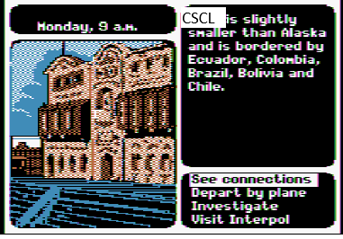

# CSCL-CHANGE-DETECTIVE

We will compare CSCL data to upstream or downstream sources. When one source changes we will send interpol notices to alert the data cops that suspect data is on the lam. Friends, this is our data gumshoe, our data laws, the trick is never to be afraid. 



## Dependencies

1. [Arcpy](https://pro.arcgis.com/en/pro-app/latest/arcpy/get-started/what-is-arcpy-.htm)
2. Connectivity to a [CSCL](https://github.com/CityOfNewYork/nyc-geo-metadata/blob/main/Metadata/CSCL.md) geodatabase
3. Connectivity to the external layer ([ArcGIS Online](https://nyc.maps.arcgis.com/home/index.html), [PostGIS](https://github.com/mattyschell/howdoipostgis), more TBD)

## Investigate

The investigation will output raw intelligence dossiers in the evidence folder. The dossiers will be named like "borough" and "borough-suspect". 

The investigation will summarize these dirty dossiers in an output log. The log unsurprisingly will be in the log folder and named like investigate-Borough-20251027-151645.log 

The investigators are trained to investigate business key columns (ex borocode), text columns (ex boroname), and derived shape attributes (ex area, centroid).  Comparing centroids across storage types and environments is a proven strategy.  

### Compare a CSCL Featureclass to an ArcGIS Online Hosted Feature Layer

See geodatabase-scripts/sample-agol.bat.

python.exe .\py\investigate.py --help

```text
usage: investigate.py [-h] [--postgistable POSTGISTABLE] [--gdbwhereclause GDBWHERECLAUSE]
                      [--externalwhereclause EXTERNALWHERECLAUSE] [--shapecolumn SHAPECOLUMN]
                      [--externalshapecolumn EXTERNALSHAPECOLUMN] [--rounddigits ROUNDDIGITS]
                      [--convertfactor CONVERTFACTOR]
                      gdb gdblayer gdblayercols externalsource externallayercols evidenceroom logdir

Investigate a suspect

positional arguments:
  gdb                   Path to the cscl geodatabase
  gdblayer              Featureclass name in cscl
  gdblayercols          Comma delimited list of cscl columns
  externalsource        External layer url or database name
  externallayercols     Comma delimited list of external columns
  evidenceroom          Folder for evidence storage
  logdir                Folder for logs

options:
  -h, --help            show this help message and exit
  --postgistable POSTGISTABLE
                        External postgis table name
  --gdbwhereclause GDBWHERECLAUSE
                        Where clause for cscl
  --externalwhereclause EXTERNALWHERECLAUSE
                        Where clause for external
  --shapecolumn SHAPECOLUMN
                        Name of the derived cscl shape column
  --externalshapecolumn EXTERNALSHAPECOLUMN
                        Name of the derived external shape column
  --rounddigits ROUNDDIGITS
                        Number of digits to round shape values
  --convertfactor CONVERTFACTOR
                        Conversion factor for shape values
```

### Compare a CSCL Featureclass to a PostGIS Table 

See geodatabase-scripts/sample-postgis.bat  Same arguments as above.

```bat
> set PGHOST=xyz
> set PGUSER=abc
> set PGPASSWORD=SpreadLoveItsTheBrooklynWay
> geodatabase-scripts\sample-postgis.bat
```


## The Sentinel

The sentinel reports on all datasets that have changed in CSCL. It writes a timestamped log file under `evidenceroom\dev|stg|prd`.

We use the last modified date in versioned views, where available, for this simple check. We should be aware that some of the datasets reported may be false positives. When underlying elements of the topology get updated the geometries in the hierarchy can recalculate without any actual change to the shape or attributes.

Output file naming convention:

```text
sentinel-YYYYMMDD-HHMMSS.log
```

Run with Python:

```bat
python.exe .\py\sentinel.py dev --dbuser xxx --dbpassword xxxxx --dbname xxxx --owner xxxx --within month
```

See `geodatabase-scripts/sample-sentinel.bat` for an example.

Runtime requirement:

1. SQL*Plus must be installed and available on PATH.


## Tests

ArcGIS Online and PostGIS tests. Update the environmental with your local PostgreSQL superuser for testing.

```bat
> set PGPASSWORD=xxxxx
> geodatabase-scripts\testall.bat
```
